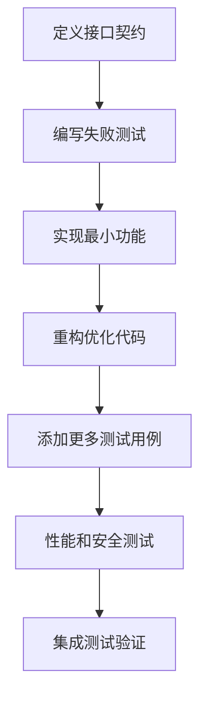

# TaKeKe Backend 测试体系与TDD流程设计

## 1. 测试架构设计原则

### 1.1 基于Context7最佳实践
- **测试驱动开发 (TDD)**: 先写测试，再写代码
- **分层测试策略**: 单元测试 → 集成测试 → 端到端测试 → 性能测试
- **真实环境测试**: 使用真实HTTP请求，不Mock
- **数据持久化验证**: 测试数据持久化，不隔离
- **快速失败机制**: 30秒内发现基础问题

### 1.2 测试覆盖率目标
- **API端点覆盖率**: 100%
- **代码行覆盖率**: >90%
- **场景覆盖率**: >95%
- **业务流程覆盖**: 100%

## 2. 测试目录结构

基于pytest最佳实践，采用以下目录结构：

```
tatake_backend/
├── tests/                           # 测试根目录
│   ├── conftest.py                  # 全局fixtures和配置
│   ├── pytest.ini                   # pytest配置文件
│   ├── .coveragerc                  # coverage配置
│   ├── domains/                     # 领域单元测试
│   │   ├── auth/                    # 认证领域测试
│   │   │   ├── conftest.py
│   │   │   ├── test_auth_service.py
│   │   │   ├── test_guest_init.py
│   │   │   └── test_jwt_validation.py
│   │   ├── task/                    # 任务领域测试
│   │   │   ├── conftest.py
│   │   │   ├── test_task_crud.py
│   │   │   ├── test_task_completion.py
│   │   │   └── test_task_tree.py
│   │   ├── reward/                  # 奖励系统测试
│   │   │   ├── conftest.py
│   │   │   ├── test_points_service.py
│   │   │   ├── test_reward_service.py
│   │   │   └── test_welcome_gift.py
│   │   ├── chat/                    # 聊天系统测试
│   │   │   ├── conftest.py
│   │   │   ├── test_chat_service.py
│   │   │   └── test_ultrathink_tools.py
│   │   └── user/                    # 用户管理测试
│   │       ├── conftest.py
│   │       └── test_user_service.py
│   ├── integration/                 # 集成测试
│   │   ├── conftest.py
│   │   ├── test_api_endpoints.py    # API端点集成测试
│   │   ├── test_database_integration.py
│   │   └── test_service_integration.py
│   ├── e2e/                        # 端到端测试
│   │   ├── conftest.py
│   │   ├── test_full_user_journey.py
│   │   ├── test_task_lifecycle.py
│   │   └── test_welcome_gift_flow.py
│   ├── performance/                 # 性能测试
│   │   ├── conftest.py
│   │   ├── test_response_times.py
│   │   ├── test_concurrent_users.py
│   │   └── test_memory_stability.py
│   ├── security/                    # 安全测试
│   │   ├── conftest.py
│   │   ├── test_authorization.py
│   │   ├── test_input_validation.py
│   │   └── test_sql_injection.py
│   ├── scenarios/                   # 场景测试
│   │   ├── test_focus_pomodoro_flow.py
│   │   ├── test_task_management_flow.py
│   │   └── test_reward_system_flow.py
│   └── utils/                      # 测试工具类
│       ├── __init__.py
│       ├── test_client.py          # HTTP客户端封装
│       ├── data_generators.py      # 测试数据生成器
│       ├── assertions.py           # 自定义断言
│       └── fixtures.py            # 共享fixtures
```

## 3. TDD实施流程

### 3.1 红绿重构循环
```python
# 1. RED: 写一个失败的测试
def test_welcome_gift_claim_should_grant_1000_points():
    """测试领取欢迎礼包应该获得1000积分"""
    response = client.post("/api/v3/user/welcome-gift/claim")
    assert response.status_code == 200
    data = response.json()
    assert data["code"] == 200
    assert data["data"]["points_granted"] == 1000

# 2. GREEN: 写最少代码让测试通过
# 3. REFACTOR: 重构代码保持测试通过
```

### 3.2 测试优先级策略
1. **P0 - 核心流程**: 用户认证、任务CRUD、礼包领取
2. **P1 - 重要功能**: 积分系统、奖励兑换、聊天功能
3. **P2 - 辅助功能**: Top3系统、Focus番茄钟
4. **P3 - 边缘场景**: 错误处理、并发场景

### 3.3 测试编写顺序


## 4. 测试配置和基础设施

### 4.1 pytest配置 (pytest.ini)
```ini
[tool:pytest]
testpaths = tests
python_files = test_*.py
python_classes = Test*
python_functions = test_*
addopts =
    --strict-markers
    --strict-config
    --cov=src
    --cov-report=term-missing
    --cov-report=html:htmlcov
    --cov-report=xml
    --cov-fail-under=90
    --tb=short
    --maxfail=10
    --durations=10

markers =
    unit: 单元测试标记
    integration: 集成测试标记
    e2e: 端到端测试标记
    slow: 慢速测试标记
    performance: 性能测试标记
    security: 安全测试标记
    smoke: 冒烟测试标记
    regression: 回归测试标记
```

### 4.2 Coverage配置 (.coveragerc)
```ini
[run]
source = src
omit =
    */tests/*
    */migrations/*
    */__pycache__/*
    */conftest.py
    */venv/*
    */env/*
    setup.py

[report]
exclude_lines =
    pragma: no cover
    def __repr__
    raise AssertionError
    raise NotImplementedError
    if __name__ == "__main__":
    class .*\(Protocol\):
    @(abc\.)?abstractmethod

[html]
directory = htmlcov
show_contexts = True

[xml]
output = coverage.xml
```

### 4.3 全局Fixtures (tests/conftest.py)
```python
import pytest
import asyncio
from typing import AsyncGenerator, Dict, Any
from httpx import AsyncClient
from src.api.main import app
from src.database import get_db_session
from src.domains.auth.service import AuthService
from src.domains.reward.service import PointsService

@pytest.fixture(scope="session")
def event_loop():
    """创建事件循环"""
    loop = asyncio.get_event_loop_policy().new_event_loop()
    yield loop
    loop.close()

@pytest.fixture(scope="function")
async def test_client() -> AsyncGenerator[AsyncClient, None]:
    """创建测试客户端"""
    async with AsyncClient(app=app, base_url="http://test") as client:
        yield client

@pytest.fixture(scope="function")
async def test_db():
    """测试数据库会话"""
    session_gen = get_db_session()
    session = next(session_gen)
    try:
        yield session
    finally:
        await session.close()

@pytest.fixture(scope="function")
async def guest_user(test_client: AsyncClient) -> Dict[str, Any]:
    """创建游客用户"""
    response = await test_client.post("/api/v3/auth/guest-init")
    assert response.status_code == 200
    data = response.json()
    return {
        "user_id": data["data"]["user_id"],
        "access_token": data["data"]["access_token"],
        "refresh_token": data["data"]["refresh_token"]
    }

@pytest.fixture(scope="function")
async def registered_user(test_client: AsyncClient) -> Dict[str, Any]:
    """创建注册用户"""
    # 先创建游客
    guest_data = await guest_user(test_client)
    # 模拟微信注册
    register_data = {
        "wechat_openid": f"test_openid_{id(guest_data)}",
        "nickname": "测试用户"
    }
    headers = {"Authorization": f"Bearer {guest_data['access_token']}"}
    response = await test_client.post("/api/v3/auth/wechat-register", json=register_data, headers=headers)
    assert response.status_code == 200
    data = response.json()
    return {
        "user_id": data["data"]["user_id"],
        "access_token": data["data"]["access_token"],
        "wechat_openid": register_data["wechat_openid"]
    }
```

## 5. 测试执行策略

### 5.1 分层测试执行
```bash
# 快速单元测试 (1分钟内完成)
pytest tests/domains/ -m "unit" --tb=short

# 集成测试 (2分钟内完成)
pytest tests/integration/ -m "integration" --tb=short

# 端到端测试 (5分钟内完成)
pytest tests/e2e/ -m "e2e" --tb=short

# 完整测试套件 (10分钟内完成)
pytest tests/ --cov=src --cov-report=html
```

### 5.2 CI/CD集成策略
```yaml
# .github/workflows/test.yml
name: 测试流水线
on: [push, pull_request]

jobs:
  quick-test:
    runs-on: ubuntu-latest
    steps:
      - uses: actions/checkout@v3
      - name: 设置Python环境
        uses: actions/setup-python@v4
        with:
          python-version: '3.11'
      - name: 安装依赖
        run: |
          pip install uv
          uv sync
      - name: 快速测试
        run: |
          pytest tests/domains/ -m "unit" --maxfail=3

  full-test:
    needs: quick-test
    runs-on: ubuntu-latest
    steps:
      - uses: actions/checkout@v3
      - name: 设置Python环境
        uses: actions/setup-python@v4
        with:
          python-version: '3.11'
      - name: 安装依赖
        run: |
          pip install uv
          uv sync
      - name: 完整测试
        run: |
          pytest tests/ --cov=src --cov-report=xml
      - name: 上传覆盖率报告
        uses: codecov/codecov-action@v3
```

## 6. 测试质量保证

### 6.1 测试命名约定
```python
# 格式: test_[功能]_[场景]_[期望结果]
def test_welcome_gift_claim_should_grant_exactly_1000_points():
    """测试领取欢迎礼包应该精确获得1000积分"""
    pass

def test_welcome_gift_claim_should_include_fixed_rewards():
    """测试领取欢迎礼包应该包含固定奖励组合"""
    pass

def test_welcome_gift_claim_should_be_repeatable():
    """测试欢迎礼包应该可以重复领取"""
    pass
```

### 6.2 测试断言策略
```python
# 使用具体断言而不是通用断言
assert response.status_code == 200  # ✅ 好
assert response.ok                  # ❌ 不够具体

assert data["code"] == 200         # ✅ 好
assert "code" in data             # ❌ 不够具体

# 使用自定义断言方法
def assert_api_success(response, expected_data=None):
    """断言API响应成功"""
    assert response.status_code == 200
    data = response.json()
    assert data["code"] == 200
    assert data["message"] == "success"
    if expected_data:
        assert data["data"] == expected_data
    return data
```

### 6.3 测试数据管理
```python
class TestDataGenerator:
    """测试数据生成器"""

    @staticmethod
    def generate_task_data(overrides=None):
        """生成任务测试数据"""
        default_data = {
            "title": "测试任务",
            "description": "这是一个测试任务",
            "priority": "medium",
            "tags": ["测试"]
        }
        if overrides:
            default_data.update(overrides)
        return default_data

    @staticmethod
    def generate_user_data(overrides=None):
        """生成用户测试数据"""
        default_data = {
            "wechat_openid": f"test_openid_{uuid.uuid4().hex[:8]}",
            "nickname": "测试用户"
        }
        if overrides:
            default_data.update(overrides)
        return default_data
```

## 7. 并发测试策略

### 7.1 并发用户测试
```python
@pytest.mark.performance
@pytest.mark.asyncio
async def test_concurrent_welcome_gift_claims():
    """测试10个用户同时领取欢迎礼包"""
    import asyncio
    from concurrent.futures import ThreadPoolExecutor

    async def claim_gift(user_id: str):
        async with AsyncClient(app=app, base_url="http://test") as client:
            # 创建用户
            response = await client.post("/api/v3/auth/guest-init")
            access_token = response.json()["data"]["access_token"]

            # 领取礼包
            headers = {"Authorization": f"Bearer {access_token}"}
            response = await client.post("/api/v3/user/welcome-gift/claim", headers=headers)
            return response.json()

    # 并发执行
    tasks = [claim_gift(f"user_{i}") for i in range(10)]
    results = await asyncio.gather(*tasks, return_exceptions=True)

    # 验证所有请求都成功
    for result in results:
        assert not isinstance(result, Exception)
        assert result["code"] == 200
```

### 7.2 竞态条件测试
```python
@pytest.mark.security
async def test_concurrent_task_completion_race_condition():
    """测试并发任务完成的竞态条件"""
    async def complete_task(task_id: str, user_token: str):
        async with AsyncClient(app=app, base_url="http://test") as client:
            headers = {"Authorization": f"Bearer {user_token}"}
            return await client.post(f"/api/v3/tasks/{task_id}/complete", headers=headers)

    # 模拟同一用户多次完成同一任务
    tasks = [complete_task("task_123", "user_token") for _ in range(5)]
    results = await asyncio.gather(*tasks, return_exceptions=True)

    # 验证只有一个成功，其他返回适当错误
    successful_count = sum(1 for r in results if not isinstance(r, Exception) and r.status_code == 200)
    assert successful_count == 1
```

## 8. 性能基准测试

### 8.1 响应时间基准
```python
@pytest.mark.performance
@pytest.mark.parametrize("endpoint", [
    "/api/v3/auth/guest-init",
    "/api/v3/tasks",
    "/api/v3/user/welcome-gift/claim"
])
async def test_endpoint_response_time(endpoint):
    """测试API端点响应时间"""
    import time

    start_time = time.time()
    async with AsyncClient(app=app, base_url="http://test") as client:
        if endpoint == "/api/v3/user/welcome-gift/claim":
            # 需要先创建用户
            auth_response = await client.post("/api/v3/auth/guest-init")
            token = auth_response.json()["data"]["access_token"]
            headers = {"Authorization": f"Bearer {token}"}
            response = await client.post(endpoint, headers=headers)
        else:
            response = await client.post(endpoint)

    response_time = time.time() - start_time

    # P95响应时间应小于200ms
    assert response_time < 0.2, f"{endpoint} 响应时间 {response_time}s 超过200ms"
```

### 8.2 内存稳定性测试
```python
@pytest.mark.performance
@pytest.mark.slow
async def test_memory_stability():
    """测试长时间运行的内存稳定性"""
    import psutil
    import os

    process = psutil.Process(os.getpid())
    initial_memory = process.memory_info().rss

    # 模拟1小时的持续负载（加速版）
    for i in range(100):  # 100次循环模拟1小时
        async with AsyncClient(app=app, base_url="http://test") as client:
            # 执行各种API操作
            await client.post("/api/v3/auth/guest-init")
            await client.get("/api/v3/tasks")

            if i % 10 == 0:  # 每10次检查一次内存
                current_memory = process.memory_info().rss
                memory_growth = current_memory - initial_memory
                # 内存增长不应超过100MB
                assert memory_growth < 100 * 1024 * 1024, f"内存增长 {memory_growth / 1024 / 1024:.2f}MB"
```

## 9. 错误处理测试

### 9.1 HTTP状态码覆盖
```python
@pytest.mark.regression
async def test_401_unauthorized_scenarios():
    """测试401未授权场景"""
    async with AsyncClient(app=app, base_url="http://test") as client:
        # 无token访问受保护端点
        response = await client.get("/api/v3/tasks")
        assert response.status_code == 401

        # 无效token
        headers = {"Authorization": "Bearer invalid_token"}
        response = await client.get("/api/v3/tasks", headers=headers)
        assert response.status_code == 401

@pytest.mark.regression
async def test_404_not_found_scenarios():
    """测试404资源不存在场景"""
    async with AsyncClient(app=app, base_url="http://test") as client:
        # 访问不存在的任务
        response = await client.get("/api/v3/tasks/nonexistent_task")
        assert response.status_code == 404

        # 访问不存在的端点
        response = await client.get("/api/v3/nonexistent")
        assert response.status_code == 404
```

### 9.2 业务逻辑错误测试
```python
@pytest.mark.regression
async def test_business_logic_errors():
    """测试业务逻辑错误"""
    async with AsyncClient(app=app, base_url="http://test") as client:
        # 创建用户
        auth_response = await client.post("/api/v3/auth/guest-init")
        token = auth_response.json()["data"]["access_token"]
        headers = {"Authorization": f"Bearer {token}"}

        # 尝试完成不存在的任务
        response = await client.post("/api/v3/tasks/nonexistent/complete", headers=headers)
        assert response.status_code == 404

        # 尝试用负积分兑换奖励
        response = await client.post("/api/v3/reward/exchange",
                                  json={"reward_id": "reward_123", "points": -100},
                                  headers=headers)
        assert response.status_code == 400
```

## 10. 测试报告和监控

### 10.1 测试报告生成
```bash
# 生成HTML测试报告
pytest tests/ --html=reports/test_report.html --self-contained-html

# 生成覆盖率报告
pytest tests/ --cov=src --cov-report=html --cov-report=xml

# 生成性能报告
pytest tests/performance/ --benchmark-json=reports/benchmark.json
```

### 10.2 测试监控和告警
```python
# tests/monitoring/test_quality_metrics.py
def test_quality_gates():
    """测试质量门禁"""
    coverage_report = get_coverage_report()
    assert coverage_report["total_coverage"] >= 90

    performance_report = get_performance_report()
    assert performance_report["p95_response_time"] < 0.2

    security_report = get_security_scan_report()
    assert len(security_report["high_vulnerabilities"]) == 0
```

这个测试体系设计确保了：
1. **全面覆盖**: API端点、业务逻辑、性能、安全的全方位测试
2. **TDD流程**: 遵循红绿重构循环，先写测试再写代码
3. **快速反馈**: 30秒快速失败，5分钟完整验证
4. **质量保证**: 90%+覆盖率，性能基准，安全扫描
5. **持续集成**: 完整的CI/CD流水线集成
6. **易于维护**: 清晰的目录结构和命名约定