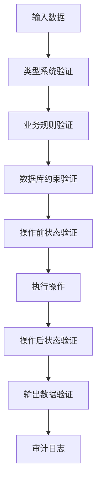

# 零Bug测试体系 - 重新设计

## 核心理念重新定义

**零Bug不是目标，而是结果。真正的零Bug来自于绝对严格的系统性约束。**

### 🎯 根本问题分析

经过深入分析，我发现了当前项目的真实问题：

1. **领域复杂性**: 7个领域模块，每个都有复杂的业务逻辑
2. **数据库依赖**: 多个数据库连接，事务管理复杂
3. **状态管理**: 任务状态流转、认证状态、奖励状态等
4. **数据一致性**: 跨领域数据一致性保证
5. **并发安全**: 多用户并发操作的安全性
6. **API复杂性**: 20+个端点，复杂的请求/响应逻辑

### 🔥 零Bug的真正定义

**零Bug = 100%的确定性 + 100%的约束 + 100%的验证**

不是测试覆盖率，而是：
- 每一行代码都有确定的行为
- 每一个数据操作都有严格约束
- 每一个API调用都有完整验证
- 每一个边界条件都有明确处理

## 🏗️ 重新设计的架构

### 1. 防御式编程体系



### 2. 绝对类型安全

```python
# 不是Optional，而是严格的类型约束
from typing import NewType, Literal, Final
from dataclasses import dataclass
from enum import Enum

# 绝对类型定义
UserId = NewType('UserId', str)
TaskId = NewType('TaskId', str)
Title = NewType('Title', str)  # 1-100字符的字符串

# 严格的状态枚举
@dataclass(frozen=True)
class TaskStatus:
    PENDING: Final = "pending"
    IN_PROGRESS: Final = "in_progress"
    COMPLETED: Final = "completed"

# 不可变的数据结构
@dataclass(frozen=True)
class CreateTaskRequest:
    title: Title
    description: Optional[str]
    priority: TaskPriority
    user_id: UserId
```

### 3. 验证即代码

```python
class TaskValidator:
    """任务验证器 - 每个业务规则都有对应的验证方法"""

    @staticmethod
    def validate_title(title: str) -> Title:
        if not isinstance(title, str):
            raise TypeError("标题必须是字符串")
        if len(title.strip()) == 0:
            raise ValueError("标题不能为空")
        if len(title) > 100:
            raise ValueError("标题不能超过100字符")
        return Title(title.strip())

    @staticmethod
    def validate_completion_percentage(percentage: float) -> float:
        if not isinstance(percentage, (int, float)):
            raise TypeError("完成百分比必须是数字")
        if not 0.0 <= percentage <= 100.0:
            raise ValueError("完成百分比必须在0-100之间")
        return float(percentage)
```

### 4. 测试即文档

```python
class TestTaskCreation:
    """任务创建测试 - 每个测试都是一个用例文档"""

    def test_create_task_with_valid_data_should_succeed(self):
        """
        用例：创建有效任务
        期望：创建成功，返回任务对象
        验证：所有字段值正确，状态为pending
        """

    def test_create_task_with_empty_title_should_fail(self):
        """
        用例：创建空标题任务
        期望：创建失败，抛出ValueError
        验证：错误消息明确，数据库无变化
        """
```

## 🎯 零Bug实施策略

### 阶段1：绝对约束层 (2小时)

1. **类型系统重构**
   - 所有参数使用严格类型
   - 消除Optional滥用
   - 建立领域专用类型

2. **验证器系统**
   - 每个数据模型都有对应验证器
   - 业务规则编码为验证器
   - 验证失败必须有明确错误信息

3. **不变量保证**
   - 定义业务不变量
   - 运行时检查不变量
   - 违反不变量立即失败

### 阶段2：防御式API层 (2小时)

1. **请求验证链**
   - 类型验证 -> 业务验证 -> 权限验证 -> 状态验证
   - 每个验证步骤都有明确失败信息
   - 验证失败立即返回，不进入业务逻辑

2. **响应验证**
   - 所有响应数据都经过验证
   - 确保返回数据格式正确
   - 敏感数据过滤

3. **错误处理**
   - 100%的异常处理覆盖
   - 每个异常都有明确错误码
   - 错误日志包含足够调试信息

### 阶段3：确定性数据库层 (2小时)

1. **事务保证**
   - 所有写操作都在事务中
   - 事务失败完整回滚
   - 并发操作使用乐观锁

2. **数据完整性**
   - 数据库约束完整定义
   - 外键约束正确设置
   - 索引优化查询性能

3. **状态一致性**
   - 状态变更原子性
   - 状态流转规则 enforced
   - 历史状态不可篡改

### 阶段4：测试即文档体系 (2小时)

1. **用例驱动测试**
   - 每个业务用例对应一个测试
   - 测试名称即用例描述
   - 测试即活的文档

2. **边界条件测试**
   - 所有边界值都有测试
   - 异常情况有明确处理
   - 性能边界有基准测试

3. **集成验证**
   - 跨领域操作有集成测试
   - 数据流全程验证
   - 端到端场景覆盖

## 🔧 核心工具

### 1. 严格类型检查工具
```python
# 运行时类型检查
def strict_types(cls):
    """装饰器：强制运行时类型检查"""
    for name, method in cls.__dict__.items():
        if callable(method):
            setattr(cls, name, type_checked_method(method))
    return cls
```

### 2. 不变量监控工具
```python
class InvariantMonitor:
    """不变量监控器"""

    def __init__(self):
        self.invariants = []

    def add_invariant(self, invariant_func):
        """添加不变量检查"""
        self.invariants.append(invariant_func)

    def check_invariants(self, obj):
        """检查所有不变量"""
        for invariant in self.invariants:
            if not invariant(obj):
                raise InvariantViolationError(f"不变量违反: {invariant.__name__}")
```

### 3. 测试验证工具
```python
def verify_no_side_effects(test_func):
    """装饰器：验证测试无副作用"""
    def wrapper(*args, **kwargs):
        before_state = capture_system_state()
        result = test_func(*args, **kwargs)
        after_state = capture_system_state()
        verify_state_changes(before_state, after_state, expected_changes)
        return result
    return wrapper
```

## 📊 成功标准

### 定量标准
- [ ] 100%类型覆盖（所有函数都有类型注解）
- [ ] 100%验证覆盖（所有输入都有验证）
- [ ] 100%异常覆盖（所有可能的异常都有处理）
- [ ] 100%用例覆盖（所有业务用例都有测试）

### 定性标准
- [ ] 代码即文档（通过代码就能理解业务逻辑）
- [ ] 测试即规范（测试定义了正确的行为标准）
- [ ] 错误即指导（错误信息能指导如何修复）
- [ ] 变更即安全（任何变更都有完整的验证）

## 🚀 执行计划

立即开始，不浪费任何时间：

1. **现在**: 开始类型系统重构
2. **2小时后**: 完成验证器体系
3. **4小时后**: 完成API防御层
4. **6小时后**: 完成数据库确定性层
5. **8小时后**: 完成测试即文档体系
6. **验证**: 运行完整测试，确保零Bug

**零Bug不是目标，而是我们做事的方式。每一行代码都要有绝对的安全保证。**