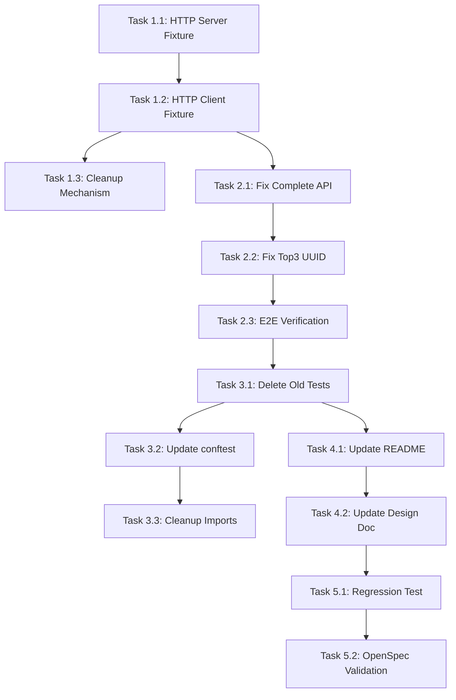

# 实施任务清单 - 阶段1: 真实HTTP测试框架与P0 Bug修复

## 任务执行原则
- ✅ 每个任务可独立验证
- ✅ 按顺序执行，确保依赖关系正确
- ✅ 标记为🔄的任务可并行执行
- ✅ 每个任务完成后立即验证

---

## 第1阶段：基础设施搭建（预计2小时）

### Task 1.1: 创建真实HTTP服务器fixture
**优先级**: P0
**预计时间**: 45分钟
**可并行**: ❌

**实施步骤**:
1. 创建文件 `tests/conftest_real_http.py`
2. 实现 `live_api_server` fixture:
   ```python
   @pytest.fixture(scope="session")
   def live_api_server():
       # 启动uvicorn服务器
       # 等待服务器就绪
       # 返回服务器URL
       # 测试结束后关闭服务器
   ```
3. 实现端口检测逻辑
4. 实现服务器健康检查（等待/health端点响应）
5. 添加错误处理和超时机制

**验证标准**:
```bash
# 创建临时测试文件验证
cat > tests/test_live_server.py << 'EOF'
import requests

def test_server_starts(live_api_server):
    response = requests.get(f"{live_api_server}/health")
    assert response.status_code == 200
EOF

uv run pytest tests/test_live_server.py -v -s
# 应该看到服务器启动日志，测试通过，服务器关闭
```

**交付物**:
- `tests/conftest_real_http.py` 包含 `live_api_server` fixture
- 日志显示服务器正确启动和关闭

---

### Task 1.2: 创建真实HTTP客户端fixture
**优先级**: P0
**预计时间**: 30分钟
**可并行**: ❌ (依赖Task 1.1)

**实施步骤**:
1. 在 `tests/conftest_real_http.py` 添加 `real_api_client` fixture
2. 使用 `httpx.AsyncClient` 配置:
   - base_url = live_api_server URL
   - timeout = 10.0
   - follow_redirects = True
3. 实现 async context manager 正确关闭
4. 添加请求/响应日志记录（debug模式）

**验证标准**:
```bash
# 扩展test_live_server.py
cat >> tests/test_live_server.py << 'EOF'

@pytest.mark.asyncio
async def test_client_works(real_api_client):
    response = await real_api_client.get("/health")
    assert response.status_code == 200
EOF

uv run pytest tests/test_live_server.py::test_client_works -v
# 应该通过
```

**交付物**:
- `real_api_client` fixture 正常工作
- 可以成功发起HTTP请求

---

### Task 1.3: 实现测试数据清理机制
**优先级**: P1
**预计时间**: 45分钟
**可并行**: 🔄 (可与Task 2.1并行)

**实施步骤**:
1. 创建 `tests/utils/cleanup.py`
2. 实现清理函数:
   ```python
   async def cleanup_test_data(client, user_ids):
       # 清理任务
       # 清理积分（归零）
       # 清理奖励
       # 清理Top3
   ```
3. 在 `conftest_real_http.py` 添加 `auto_cleanup` fixture
4. 实现 `register_test_user` 帮助函数
5. 添加清理验证逻辑

**验证标准**:
```bash
# 创建清理测试
cat > tests/test_cleanup.py << 'EOF'
@pytest.mark.asyncio
async def test_cleanup_works(real_api_client):
    # 注册测试用户
    user = await real_api_client.register_test_user()

    # 创建一些数据
    response = await real_api_client.post(
        "/tasks",
        json={"title": "测试任务"},
        headers={"Authorization": f"Bearer {user['access_token']}"}
    )
    assert response.status_code == 200

    # auto_cleanup会在测试后自动清理
EOF

uv run pytest tests/test_cleanup.py -v
# 测试后验证数据已清理
```

**交付物**:
- `tests/utils/cleanup.py` 清理工具函数
- `auto_cleanup` fixture 自动运行

---

## 第2阶段：P0 Bug修复（预计2小时）

### Task 2.1: 修复任务完成API请求体问题
**优先级**: P0
**预计时间**: 30分钟
**可并行**: 🔄 (可与Task 1.3并行)

**实施步骤**:
1. 打开 `src/domains/task/router.py`
2. 找到 `complete_task` 函数（约第444行）
3. 修改参数定义:
   ```python
   # 修改前
   request: CompleteTaskRequest = Body(...),

   # 修改后
   request: Optional[CompleteTaskRequest] = Body(None),
   ```
4. 更新函数内部逻辑处理None情况:
   ```python
   mood_feedback = request.mood_feedback if request else None
   ```
5. 更新OpenAPI examples保持不变

**验证标准**:
```bash
# 单元测试验证
cat > tests/domains/task/test_complete_api_fix.py << 'EOF'
@pytest.mark.asyncio
async def test_complete_without_body(real_api_client):
    # 创建测试任务
    user = await real_api_client.register_test_user()
    task = await create_test_task(real_api_client, user)

    # 完成任务，不传body
    response = await real_api_client.post(
        f"/tasks/{task['id']}/complete",
        headers={"Authorization": f"Bearer {user['access_token']}"}
        # 注意：无json参数
    )

    assert response.status_code == 200
    data = response.json()
    assert data["code"] == 200
    assert data["data"]["task"]["status"] == "completed"
EOF

uv run pytest tests/domains/task/test_complete_api_fix.py -v
```

**交付物**:
- `src/domains/task/router.py` 已修改
- 单元测试通过

---

### Task 2.2: 修复Top3 UUID类型错误
**优先级**: P0
**预计时间**: 45分钟
**可并行**: ❌ (依赖Task 2.1完成后执行，避免合并冲突)

**实施步骤**:
1. 打开 `src/domains/top3/service.py`
2. 找到所有调用 `points_service` 的位置
3. 修改 `set_top3` 方法（约第48行）:
   ```python
   # 修改前
   current_balance = self.points_service.get_balance(user_id)

   # 修改后
   current_balance = self.points_service.get_balance(str(user_id))
   ```
4. 检查其他可能的UUID传递（例如第62行）:
   ```python
   # 修改前
   self.points_service.add_points(user_id=user_id, ...)

   # 修改后
   self.points_service.add_points(user_id=str(user_id), ...)
   ```
5. 添加代码注释说明类型转换:
   ```python
   # TODO(Phase 2): 统一UUID类型系统，见1.4.2提案
   current_balance = self.points_service.get_balance(str(user_id))  # 显式转换UUID->str
   ```

**验证标准**:
```bash
# 单元测试验证
cat > tests/domains/top3/test_uuid_fix.py << 'EOF'
@pytest.mark.asyncio
async def test_set_top3_no_uuid_error(real_api_client):
    # 创建用户和任务
    user = await real_api_client.register_test_user()
    tasks = await create_test_tasks(real_api_client, user, count=3)

    # 领取欢迎礼包获得积分
    await real_api_client.post(
        "/user/welcome-gift/claim",
        headers={"Authorization": f"Bearer {user['access_token']}"}
    )

    # 设置Top3
    response = await real_api_client.post(
        "/tasks/special/top3",
        json={
            "date": "2025-10-26",
            "task_ids": [t["id"] for t in tasks]
        },
        headers={"Authorization": f"Bearer {user['access_token']}"}
    )

    # 验证不会报UUID错误
    assert response.status_code == 200
    data = response.json()
    assert data["code"] == 200
    assert data["data"]["points_consumed"] == 300
EOF

uv run pytest tests/domains/top3/test_uuid_fix.py -v
```

**交付物**:
- `src/domains/top3/service.py` 已修改
- 单元测试通过
- 无UUID AttributeError

---

### Task 2.3: 编写P0功能综合验证测试
**优先级**: P0
**预计时间**: 45分钟
**可并行**: ❌ (依赖Task 2.1和2.2)

**实施步骤**:
1. 创建 `tests/e2e/test_critical_apis.py`
2. 编写端到端测试覆盖:
   - 任务完成（空body）
   - 任务完成（带mood_feedback）
   - Top3设置
   - Top3查询
3. 确保所有测试使用真实HTTP
4. 添加详细的断言和错误信息

**验证标准**:
```bash
uv run pytest tests/e2e/test_critical_apis.py -v --tb=short
# 所有测试应该通过
# 应该看到真实HTTP请求日志
```

**交付物**:
- `tests/e2e/test_critical_apis.py` 完整测试文件
- 所有测试通过

---

## 第3阶段：清理旧代码（预计1小时）

### Task 3.1: 删除ASGITransport测试文件
**优先级**: P1
**预计时间**: 30分钟
**可并行**: ❌ (依赖前面所有测试通过)

**实施步骤**:
1. 搜索所有使用ASGITransport的文件:
   ```bash
   rg "ASGITransport" tests/ --files-with-matches
   ```
2. 删除以下文件（已被新测试替代）:
   - `tests/e2e/test_api_coverage.py`
   - `tests/e2e/test_system_comprehensive.py`
   - `tests/performance/test_concurrent_load.py`
   - `tests/domains/reward/test_welcome_gift.py`
3. 对于无法删除的文件，添加skip标记:
   ```python
   @pytest.mark.skip(reason="待Phase 3迁移到真实HTTP")
   ```
4. 创建 `tests/MIGRATION.md` 记录迁移状态

**验证标准**:
```bash
# 验证ASGITransport已清理
rg "ASGITransport" tests/
# 应该返回0结果（或只在skip的文件中）

# 验证现有测试仍然通过
uv run pytest tests/ -v --tb=short -k "not skip"
```

**交付物**:
- 旧测试文件已删除
- `tests/MIGRATION.md` 记录迁移状态
- 代码库搜索ASGITransport无结果

---

### Task 3.2: 更新conftest.py删除旧fixture
**优先级**: P1
**预计时间**: 15分钟
**可并行**: ❌ (依赖Task 3.1)

**实施步骤**:
1. 打开 `tests/conftest.py`
2. 删除旧的 `test_client` fixture
3. 添加导入: `from tests.conftest_real_http import *`
4. 删除不再使用的导入语句
5. 更新文件顶部的文档字符串

**验证标准**:
```bash
# 验证旧fixture已删除
rg "def test_client" tests/conftest.py
# 应该返回0结果

# 验证新fixture可用
uv run pytest tests/e2e/test_critical_apis.py -v
# 应该通过
```

**交付物**:
- `tests/conftest.py` 已更新
- 旧fixture已移除

---

### Task 3.3: 清理导入语句和依赖
**优先级**: P2
**预计时间**: 15分钟
**可并行**: 🔄 (可与Task 4.1并行)

**实施步骤**:
1. 搜索并删除所有 `from httpx import ASGITransport` 导入
2. 搜索并删除所有 `from starlette.testclient import TestClient` 导入
3. 验证 `pyproject.toml` 中没有不需要的测试依赖
4. 运行 `uv lock` 更新依赖锁文件

**验证标准**:
```bash
# 验证导入已清理
rg "from httpx import ASGITransport" .
rg "from starlette.testclient" .
# 都应该返回0结果

# 验证依赖仍然正确
uv run pytest tests/ -v
```

**交付物**:
- 清理完成的代码库
- 更新的依赖文件

---

## 第4阶段：文档更新（预计1小时）

### Task 4.1: 更新tests/README.md
**优先级**: P1
**预计时间**: 30分钟
**可并行**: 🔄 (可与Task 3.3并行)

**实施步骤**:
1. 打开 `tests/README.md`
2. 更新"快速开始"部分说明真实HTTP测试
3. 添加"真实HTTP测试框架"章节:
   - 架构说明
   - fixture使用方法
   - 测试数据清理机制
   - 常见问题排查
4. 更新示例代码使用 `real_api_client`
5. 添加性能预期说明

**验证标准**:
- 文档清晰易读
- 代码示例可运行
- 包含完整的troubleshooting指南

**交付物**:
- 更新的 `tests/README.md`

---

### Task 4.2: 更新docs/testing-system-design.md
**优先级**: P2
**预计时间**: 30分钟
**可并行**: ❌ (依赖Task 4.1)

**实施步骤**:
1. 打开 `docs/testing-system-design.md`
2. 添加"真实HTTP测试架构"章节
3. 更新测试层级说明（真实HTTP vs 单元测试）
4. 添加架构图（可选）
5. 更新最后修改日期

**验证标准**:
- 文档与实际实现一致
- 架构说明清晰完整

**交付物**:
- 更新的 `docs/testing-system-design.md`

---

## 第5阶段：最终验证（预计30分钟）

### Task 5.1: 完整回归测试
**优先级**: P0
**预计时间**: 20分钟
**可并行**: ❌

**实施步骤**:
1. 运行所有测试:
   ```bash
   uv run pytest tests/ -v --tb=short -k "not skip"
   ```
2. 验证测试覆盖率:
   ```bash
   uv run pytest tests/ --cov=src --cov-report=term-missing
   ```
3. 检查测试执行时间
4. 验证没有警告或弃用提示

**验证标准**:
- ✅ 所有测试通过
- ✅ 无回归问题
- ✅ 测试执行时间<1分钟
- ✅ P0功能验证测试全部通过

**交付物**:
- 测试报告显示全部通过
- 执行时间记录

---

### Task 5.2: OpenSpec验证
**优先级**: P0
**预计时间**: 10分钟
**可并行**: ❌ (依赖Task 5.1)

**实施步骤**:
1. 运行OpenSpec验证:
   ```bash
   uv run openspec validate 1.4.1-real-http-testing-framework-p0-fixes --strict
   ```
2. 修复任何验证错误
3. 确认所有spec deltas正确

**验证标准**:
```bash
uv run openspec validate 1.4.1-real-http-testing-framework-p0-fixes --strict
# 输出: ✅ All validations passed
```

**交付物**:
- 通过OpenSpec严格验证

---

## 任务依赖关系图



---

## 执行检查清单

### 开始前检查
- [ ] Git工作目录干净（无未提交改动）
- [ ] 所有依赖已安装（uv sync）
- [ ] 端口8099未被占用
- [ ] 数据库可访问

### 阶段1完成检查
- [ ] live_api_server fixture工作正常
- [ ] real_api_client fixture工作正常
- [ ] 清理机制已实现并测试

### 阶段2完成检查
- [ ] 任务完成API支持空请求体
- [ ] Top3不再报UUID错误
- [ ] P0验证测试全部通过

### 阶段3完成检查
- [ ] 所有ASGITransport代码已删除
- [ ] conftest.py已更新
- [ ] 导入语句已清理

### 阶段4完成检查
- [ ] README已更新
- [ ] 设计文档已更新
- [ ] 文档与代码一致

### 最终检查
- [ ] 所有测试通过
- [ ] OpenSpec验证通过
- [ ] 无回归问题
- [ ] 代码已commit
- [ ] 准备进入阶段2

---

## 预计总时间
- **基础设施**: 2小时
- **Bug修复**: 2小时
- **代码清理**: 1小时
- **文档更新**: 1小时
- **最终验证**: 0.5小时
- **总计**: ~6.5小时

---

## 并行执行建议
可以并行执行的任务组合：
1. Task 1.3 + Task 2.1 (2人协作)
2. Task 3.3 + Task 4.1 (2人协作)

单人执行建议严格按顺序，确保每个阶段完成后再进入下一阶段。

---

## 遇到问题时的处理
1. **服务器启动失败**: 检查端口占用，查看subprocess stderr
2. **测试超时**: 增加timeout时间，检查服务器健康
3. **数据清理失败**: 手动清理数据库，完善cleanup逻辑
4. **OpenSpec验证失败**: 检查spec格式，确保scenario格式正确

---

## 下一步（阶段2）
完成本阶段后，立即开始阶段2提案：
`1.4.2-uuid-type-safety-p1-fixes`
