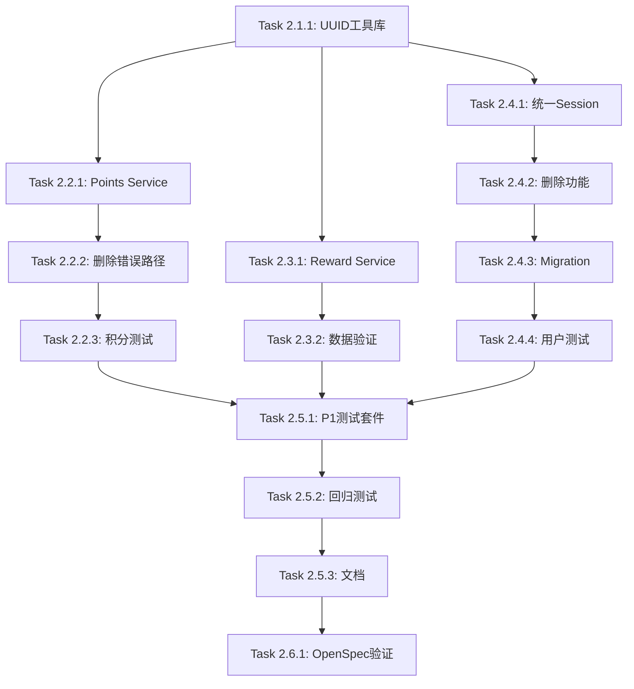

# 实施任务清单 - 阶段2: UUID类型系统统一与P1级Bug修复

## 前置条件
- ✅ 阶段1已完成（1.4.1-real-http-testing-framework-p0-fixes）
- ✅ 真实HTTP测试框架已可用
- ✅ P0 bug已修复（任务完成API、Top3 UUID）

## 注意
根据代码检查，以下修复可能已部分完成：
- `src/domains/task/router.py:19` - CompleteTaskRequest已改为Optional
- `src/domains/top3/service.py:43` - user_id已转换为str

需要验证这些修复是否完整，并完成其他UUID转换工作。

---

## 第1阶段：UUID工具集开发（预计1小时）

### Task 2.1.1: 创建UUID转换工具库
**优先级**: P0
**预计时间**: 45分钟

**实施步骤**:
1. 创建`src/utils/__init__.py`（如果不存在）
2. 创建`src/utils/uuid_helpers.py`
3. 实现核心函数：
   - `ensure_uuid(value: Union[str, UUID, None]) -> Optional[UUID]`
   - `ensure_str(value: Union[str, UUID, None]) -> Optional[str]`
   - `uuid_list_to_str(uuids: List[Union[str, UUID]]) -> List[str]`
   - `str_list_to_uuid(strings: List[str]) -> List[UUID]`
4. 添加完整的类型注解和文档字符串
5. 添加错误处理和日志记录

**验证标准**:
```bash
# 创建单元测试
cat > tests/unit/test_uuid_helpers.py << 'EOF'
from uuid import UUID
from src.utils.uuid_helpers import ensure_uuid, ensure_str

def test_ensure_uuid():
    # str -> UUID
    result = ensure_uuid("550e8400-e29b-41d4-a716-446655440000")
    assert isinstance(result, UUID)

    # UUID -> UUID (幂等)
    uuid_obj = UUID("550e8400-e29b-41d4-a716-446655440000")
    result = ensure_uuid(uuid_obj)
    assert result == uuid_obj

    # None -> None
    assert ensure_uuid(None) is None

def test_ensure_str():
    uuid_obj = UUID("550e8400-e29b-41d4-a716-446655440000")
    result = ensure_str(uuid_obj)
    assert result == "550e8400-e29b-41d4-a716-446655440000"
EOF

uv run pytest tests/unit/test_uuid_helpers.py -v
```

**交付物**:
- `src/utils/uuid_helpers.py` 完整实现
- 单元测试通过

---

## 第2阶段：积分系统UUID修复（预计1.5小时）

### Task 2.2.1: 修复PointsService UUID处理
**优先级**: P1
**预计时间**: 45分钟

**实施步骤**:
1. 打开`src/domains/points/service.py`
2. 导入UUID工具：
   ```python
   from src.utils.uuid_helpers import ensure_str
   from typing import Union
   from uuid import UUID
   ```
3. 修改所有方法签名添加类型注解：
   - `calculate_balance(self, user_id: Union[str, UUID]) -> int`
   - `get_balance(self, user_id: Union[str, UUID]) -> int`
   - `add_points(self, user_id: Union[str, UUID], ...) -> PointsTransaction`
   - `get_transactions(self, user_id: Union[str, UUID], ...) -> List[PointsTransaction]`
4. 在每个方法开头添加转换：
   ```python
   user_id_str = ensure_str(user_id)
   ```
5. 更新所有SQL查询使用`user_id_str`

**验证标准**:
```bash
# 运行相关测试
uv run pytest tests/domains/points/ -v
```

**交付物**:
- `src/domains/points/service.py` 更新完成
- 所有方法支持UUID/str参数

### Task 2.2.2: 删除错误的积分API路径
**优先级**: P1
**预计时间**: 15分钟

**实施步骤**:
1. 打开`src/domains/points/router.py`（如果存在）
2. 或打开`src/domains/reward/router.py`（points_router在这里）
3. 确认只有以下路径：
   - `GET /points/my-points` ✅
   - `GET /points/transactions` ✅
4. 删除任何`/points/balance`路径（如果存在）
5. 更新OpenAPI文档标签和描述

**验证标准**:
```bash
# 验证路径正确
rg "@points_router.get.*balance" src/
# 应该只返回my-points，不应该有balance

# 测试验证
uv run pytest tests/e2e/test_p1_bugs.py::test_points_balance_api -v
```

### Task 2.2.3: 编写积分系统验证测试
**优先级**: P1
**预计时间**: 30分钟

**实施步骤**:
1. 创建`tests/e2e/test_p1_bugs.py`
2. 编写测试：
   ```python
   async def test_points_balance_api(real_api_client):
       # 创建用户
       user = await real_api_client.register_test_user()

       # 领取欢迎礼包
       await real_api_client.post(
           "/user/welcome-gift/claim",
           headers={"Authorization": f"Bearer {user['access_token']}"}
       )

       # 获取积分余额
       response = await real_api_client.get(
           "/points/my-points",
           headers={"Authorization": f"Bearer {user['access_token']}"}
       )

       assert response.status_code == 200
       data = response.json()
       assert data["code"] == 200
       assert data["data"]["current_balance"] == 1000
   ```

**验证标准**:
```bash
uv run pytest tests/e2e/test_p1_bugs.py::test_points_balance_api -v
```

---

## 第3阶段：奖励系统UUID修复（预计1.5小时）

### Task 2.3.1: 修复RewardService UUID处理
**优先级**: P1
**预计时间**: 45分钟

**实施步骤**:
1. 打开`src/domains/reward/service.py`
2. 导入UUID工具
3. 更新所有方法类型注解
4. 在关键方法添加UUID转换和日志：
   ```python
   def get_my_rewards(self, user_id: Union[str, UUID]) -> dict:
       user_id_str = ensure_str(user_id)
       logger.info(f"查询用户{user_id_str}的奖励")

       statement = select(UserReward).where(
           UserReward.user_id == user_id_str
       )
       rewards = self.session.exec(statement).all()

       logger.info(f"查询到{len(rewards)}条奖励记录")

       if not rewards:
           logger.warning(f"用户{user_id_str}暂无奖励记录")
           return {"rewards": {}, "total_types": 0}
       # ...
   ```

**交付物**:
- `src/domains/reward/service.py` 更新完成
- 所有查询使用str类型

### Task 2.3.2: 增强WelcomeGiftService数据验证
**优先级**: P1
**预计时间**: 45分钟

**实施步骤**:
1. 打开`src/domains/reward/welcome_gift_service.py`
2. 在`claim_welcome_gift`方法添加数据验证：
   ```python
   # 发放奖励后
   self.session.flush()

   # 验证数据写入
   verify_count = self.session.execute(
       select(func.count()).select_from(UserReward)
       .where(UserReward.user_id == str(user_uuid))
   ).scalar()

   if verify_count == 0:
       self.session.rollback()
       raise Exception("奖励数据写入失败")

   logger.info(f"奖励数据验证成功：{verify_count}条记录")
   self.session.commit()
   ```

**验证标准**:
```bash
# 测试欢迎礼包领取和查询
uv run pytest tests/domains/reward/test_welcome_gift.py -v
```

---

## 第4阶段：用户管理修复与清理（预计2小时）

### Task 2.4.1: 统一Session依赖
**优先级**: P1
**预计时间**: 30分钟

**实施步骤**:
1. 删除`src/domains/user/database.py`文件
2. 更新`src/domains/user/router.py`：
   ```python
   # 删除
   from .database import get_user_session

   # 添加
   from src.database import SessionDep
   from src.utils.uuid_helpers import ensure_str
   ```
3. 更新所有endpoint：
   ```python
   # 修改前
   session: Session = Depends(get_user_session)

   # 修改后
   session: SessionDep
   ```
4. 更新所有UUID查询：
   ```python
   user = session.get(Auth, ensure_str(user_id))
   ```

**验证标准**:
```bash
rg "get_user_session" src/
# 应该返回0结果

uv run pytest tests/domains/user/ -v
```

### Task 2.4.2: 删除Avatar和Feedback功能
**优先级**: P1
**预计时间**: 45分钟

**实施步骤**:
1. 打开`src/domains/user/router.py`
2. 删除以下endpoint：
   - `@router.post("/avatar")` 及其函数
   - `@router.post("/feedback")` 及其函数
3. 打开`src/domains/user/schemas.py`
4. 删除以下Schema：
   - `class AvatarUploadResponse`
   - `class FeedbackRequest`
   - `class FeedbackSubmitResponse`
5. 更新`__all__`导出列表

**验证标准**:
```bash
rg "AvatarUploadResponse|FeedbackRequest|submit_feedback|upload_avatar" src/
# 应该返回0结果
```

### Task 2.4.3: 创建数据库Migration
**优先级**: P1
**预计时间**: 30分钟

**实施步骤**:
1. 创建Alembic migration（如果项目使用Alembic）:
   ```bash
   uv run alembic revision -m "remove_avatar_and_feedback"
   ```
2. 编辑migration文件：
   ```python
   def upgrade():
       op.drop_column('auth', 'avatar')
       # 如果存在feedback表
       op.execute("DROP TABLE IF EXISTS feedback")

   def downgrade():
       op.add_column('auth',
           sa.Column('avatar', sa.String(), nullable=True)
       )
       # 不恢复feedback表
   ```
3. 运行migration：
   ```bash
   uv run alembic upgrade head
   ```

**注意**：如果项目没有使用Alembic，需要手动修改SQLModel定义并重建数据库。

**验证标准**:
```bash
# 验证字段已删除
sqlite3 tatake.db ".schema auth"
# 应该不包含avatar字段
```

### Task 2.4.4: 编写用户管理验证测试
**优先级**: P1
**预计时间**: 15分钟

**实施步骤**:
1. 在`tests/e2e/test_p1_bugs.py`添加测试：
   ```python
   async def test_user_profile_crud(real_api_client):
       user = await real_api_client.register_test_user()

       # GET profile
       response = await real_api_client.get(
           "/user/profile",
           headers={"Authorization": f"Bearer {user['access_token']}"}
       )
       assert response.status_code == 200

       # PUT profile
       response = await real_api_client.put(
           "/user/profile",
           json={"nickname": "新昵称"},
           headers={"Authorization": f"Bearer {user['access_token']}"}
       )
       assert response.status_code == 200
   ```

**验证标准**:
```bash
uv run pytest tests/e2e/test_p1_bugs.py::test_user_profile_crud -v
```

---

## 第5阶段：全面测试与文档（预计1.5小时）

### Task 2.5.1: 编写完整的P1验证测试套件
**优先级**: P0
**预计时间**: 45分钟

**实施步骤**:
1. 完善`tests/e2e/test_p1_bugs.py`
2. 包含所有P1 bug的验证测试：
   - 积分余额API
   - 积分流水API
   - 奖励查询API
   - 用户profile CRUD
   - 已删除功能返回404

**验证标准**:
```bash
uv run pytest tests/e2e/test_p1_bugs.py -v --tb=short
# 所有测试通过
```

### Task 2.5.2: 回归测试
**优先级**: P0
**预计时间**: 20分钟

**实施步骤**:
```bash
# 运行所有测试
uv run pytest tests/ -v --tb=short -k "not skip"

# 检查无UUID错误
# 检查无Session依赖错误
```

**验证标准**:
- 所有测试通过
- 无类型相关错误
- 测试执行时间合理

### Task 2.5.3: 编写UUID类型系统文档
**优先级**: P1
**预计时间**: 30分钟

**实施步骤**:
1. 创建`docs/uuid-type-system.md`
2. 内容包括：
   - 三层边界策略说明
   - ensure_uuid/ensure_str使用指南
   - 最佳实践示例
   - 常见错误和解决方案
   - 类型注解规范

**交付物**:
- `docs/uuid-type-system.md` 完整文档

---

## 第6阶段：OpenSpec验证（预计10分钟）

### Task 2.6.1: 验证阶段2提案
**优先级**: P0
**预计时间**: 10分钟

**实施步骤**:
```bash
uv run openspec validate 1.4.2-uuid-type-safety-p1-fixes --strict
```

**验证标准**:
- ✅ 所有spec验证通过
- ✅ 无格式错误
- ✅ 依赖关系正确

---

## 任务依赖关系图



---

## 执行检查清单

### 阶段1完成检查
- [ ] UUID工具库创建完成
- [ ] 单元测试通过

### 阶段2完成检查
- [ ] PointsService UUID处理完成
- [ ] 错误API路径已删除
- [ ] 积分测试通过

### 阶段3完成检查
- [ ] RewardService UUID处理完成
- [ ] WelcomeGiftService验证增强
- [ ] 奖励测试通过

### 阶段4完成检查
- [ ] Session依赖统一
- [ ] Avatar和Feedback功能已删除
- [ ] Migration已应用
- [ ] 用户管理测试通过

### 阶段5完成检查
- [ ] P1测试套件完成
- [ ] 回归测试通过
- [ ] UUID文档完成

### 最终检查
- [ ] 所有P1 bug已修复
- [ ] OpenSpec验证通过
- [ ] 无类型相关错误
- [ ] 准备进入阶段3

---

## 预计总时间
- **UUID工具集**: 1小时
- **积分系统**: 1.5小时
- **奖励系统**: 1.5小时
- **用户管理**: 2小时
- **测试文档**: 1.5小时
- **验证**: 0.5小时
- **总计**: ~8小时

---

## 成功标准

### 功能验证
```bash
# 1. 积分接口
curl -X GET http://localhost:8099/points/my-points -H "Authorization: Bearer $TOKEN"
# 期望：200, current_balance字段存在

# 2. 奖励查询
curl -X GET http://localhost:8099/rewards/my-rewards -H "Authorization: Bearer $TOKEN"
# 期望：200, rewards字段存在（可能为空但不报错）

# 3. 用户信息
curl -X GET http://localhost:8099/user/profile -H "Authorization: Bearer $TOKEN"
# 期望：200, 用户信息正确

# 4. 已删除功能
curl -X POST http://localhost:8099/user/avatar -H "Authorization: Bearer $TOKEN"
# 期望：404
```

### 代码质量验证
```bash
# 类型检查
uv run mypy src/ --check-untyped-defs

# UUID使用检查
rg "\.replace\(\)" src/ | rg "UUID"
# 应该返回0结果（无UUID对象调用replace）
```

---

## 遇到问题时的处理

### UUID转换错误
- 检查ensure_uuid/ensure_str调用位置
- 添加详细日志记录
- 验证数据库中ID格式

### 数据查询返回空
- 检查UUID类型是否匹配
- 验证数据库实际存储格式
- 添加查询日志

### Migration失败
- 备份数据库
- 手动执行SQL验证
- 检查字段依赖关系

---

## 下一步（阶段3）
完成本阶段后，立即开始阶段3提案：
`1.4.3-api-coverage-quality-assurance`
